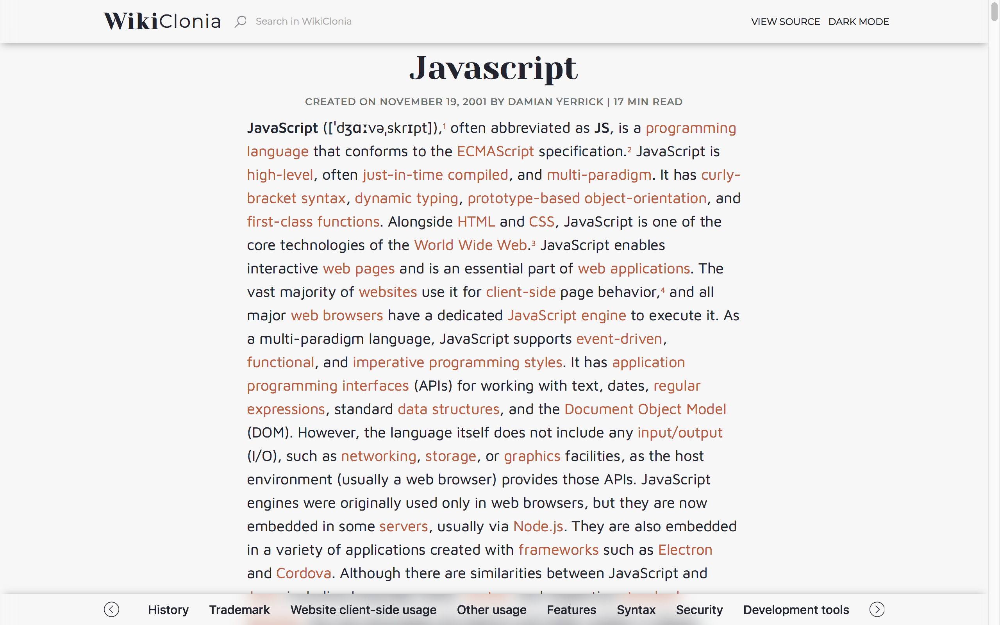
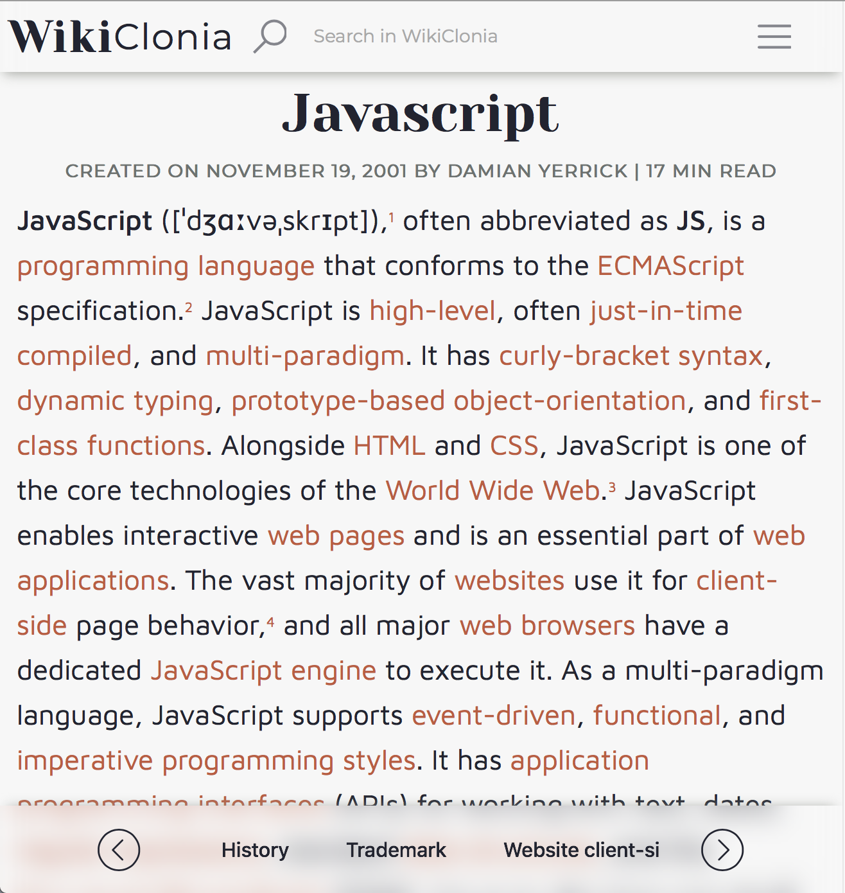

# *Wiki*Clonia

<p align="center">
  <a href="https://travis-ci.org/nam288/nam288.github.io">
    
  </a>
  <a href="https://coveralls.io/github/nam288/nam288.github.io">
    
  </a>
  
  <a href="https://github.com/prettier/prettier">
    
  </a>
</p>

<p align="center">
  <a href="#about-the-project">About</a> •
  <a href="#how-it-works">How it works</a> •
  <a href="#features">Features</a> •
  <a href="#installation--usage">Installation & Usage</a> •
  <a href="#demo">Demo</a> •
  <a href="#roadmap">Roadmap</a> •
  <a href="#contributing">Contributing</a> •
  <a href="#credits">Credits</a> •
  <a href="#contacts">Contacts</a>
</p>

---


<!-- ABOUT THE PROJECT -->

## About The Project

> ***Wikipedia*** is a multilingual online encyclopedia created and maintained as an open collaboration project by a community of volunteer editors using a wiki-based editing system. It is the largest and most popular general reference work on the World Wide Web. - Wikipedia

To make it more readable and useful, I decided to redesign it completely with the knowledge I learned when use React.

<p align="center">
  
</p>

<p align="center">
  
</p>

## Features

- Live Tooltip for quick references
- Syntax highlighting
- Dark/Light mode
- Mobile/desktop mode
- Bottom Navigation Bar
- Live Search Bar

## How it works

1. Fetch [Wikitext](https://en.wikipedia.org/wiki/Help:Wikitext) format (unparsed) from [MediaWiki API](https://www.mediawiki.org/wiki/API:Main_page).
2. Feed content into self-implemented [Parser](https://develop).
3. Use awesome [React](https://reactjs.org) library to render real web pages.

## Installation & Usage

- To clone and run this application, you'll need [Git](https://git-scm.com) and [Node.js](https://nodejs.org/en/download/) (which comes with [npm](http://npmjs.com)) installed on your computer. From your command line:

```bash
# Clone this repository
$ git clone https://github.com/nam288/WikiClonia.git

# Go into the repository
$ cd electron-markdownify

# Install dependencies
$ npm install

# Run the app
$ npm start
```

- Open favorite browser and go to `http://localhost:3000/[article-name]`

## Demo

[Demo](https://master.d2r1ueuf7wjahz.amplifyapp.com/JavaScript)

## Roadmap

See the [open issues](https://github.com/nam288/nam288.github.io/issues) for a list of proposed features (and known issues).

## Contributing

Contributions are what make the open source community such an amazing place to be learn, inspire, and create. Any contributions you make are **greatly appreciated**.

1. Fork the Project
2. Create your Feature Branch (`git checkout -b feature/AmazingFeature`)
3. Commit your Changes (`git commit -m 'Add some AmazingFeature'`)
4. Push to the Branch (`git push origin feature/AmazingFeature`)
5. Open a Pull Request

## Credits

- [Wikipedia](https://www.wikipedia.org)
- [React JS](https://reactjs.org)
- [Prettier](https://prettier.io)
- [Prism](https://prismjs.com)
- [Convert Unit](https://www.npmjs.com/package/convert-units)
- [React Spinners](https://www.npmjs.com/package/react-spinners)
- [Lazysizes](https://www.npmjs.com/package/lazysizes)

## Contact

Nam H. Le - drnam288@gmail.com
